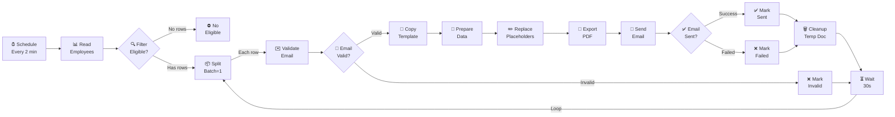

# n8n Workflow — Complete Setup Guide

> [!IMPORTANT]
> Placeholder values have been used for sensitive IDs and credentials. You will need to replace them with your actual values during setup.

## 📥 How to Import

1. Open n8n → **Workflows** → **Import from File**
2. Select `production version.json`
3. Set up credentials (see below) — n8n will prompt you to map them on import
4. **Test with Manual Execution** first before activating

---

## 🔑 Credential Setup (MUST DO IN n8n UI)

> [!CAUTION]
> The workflow JSON references credential IDs `google_oauth2` and `smtp_hostinger`. After creating each credential in n8n, you'll need to **re-map** them in the workflow nodes. n8n will prompt you during import.

### Step 1: Google OAuth2 Credential

1. n8n → **Settings** → **Credentials** → **Add Credential**
2. Search for **"Google Sheets OAuth2 API"** → Create
3. Fill in:
   - **Client ID:** `YOUR_GOOGLE_CLIENT_ID`
   - **Client Secret:** `YOUR_GOOGLE_CLIENT_SECRET`
4. Click **Sign in with Google** → Authorize access
5. **Required scopes** (ensure these are enabled in Google Cloud Console):
   - `https://www.googleapis.com/auth/spreadsheets`
   - `https://www.googleapis.com/auth/drive`
   - `https://www.googleapis.com/auth/documents`

> [!TIP]
> You need to create **3 credentials** using the SAME Client ID & Secret:
> - Google Sheets OAuth2 API
> - Google Drive OAuth2 API
> - Google Docs OAuth2 API

### Step 2: Hostinger SMTP Credential

1. n8n → **Settings** → **Credentials** → **Add Credential**
2. Search for **"SMTP"** → Create
3. Fill in:
   - **Host:** `smtp.hostinger.com`
   - **Port:** `465`
   - **SSL/TLS:** ✅ Enabled
   - **User:** `YOUR_HOSTINGER_EMAIL`
   - **Password:** `YOUR_HOSTINGER_PASSWORD`
4. Click **Save** → Test connection

### Step 3: Re-map Credentials in Workflow

After importing, click on each of these nodes and select the correct credential:
- **Read Employees** → Google Sheets OAuth2
- **Mark Invalid Email** → Google Sheets OAuth2
- **Copy Template** → Google Drive OAuth2
- **Replace Placeholders** → Google Docs OAuth2
- **Export as PDF** → Google Drive OAuth2
- **Send Offer Email** → SMTP (Hostinger)
- **Mark as Sent** → Google Sheets OAuth2
- **Mark as Failed** → Google Sheets OAuth2
- **Cleanup Temp Doc** → Google Drive OAuth2

---

## 📋 Values to Update in the Nodes

| Item | Value |
|---|---|
| Spreadsheet ID | `YOUR_GOOGLE_SHEET_ID_HERE` |
| Template Doc ID | `YOUR_TEMPLATE_DOCUMENT_ID_HERE` |
| Sender Email | `YOUR_HOSTINGER_EMAIL` |
| HR Name (in template) | `Sahana` |
| HR Email (in template) | `YOUR_HR_EMAIL` |
| Sheet Name | `Employees` |

---

## 🗺️ Workflow Architecture

---

## 📋 Template Placeholders Mapped

Your offer letter template uses these placeholders, which are replaced by the workflow:

| Placeholder | Replaced With | Source Column |
|---|---|---|
| `{{name}}` | Candidate name | `name` |
| `{{role}}` | Position title | `role` |
| `{{salary}}` | Monthly stipend | `salary` |
| `{{joining_date}}` | Start date | `start_date` |
| `{{reporting_manager}}` | Manager name | `reporting_manager` |
| `{{hr_name}}` | "Sahana" | Hardcoded |
| `{{hr_email}}` | "YOUR_HR_EMAIL" | Hardcoded |

---

## 🐛 Debugging Tips

| Symptom | Likely Cause | Fix |
|---|---|---|
| "No credential found" error | Credentials not mapped after import | Click each node → select credential from dropdown |
| Replace Placeholders shows red | Copy Template overwrote data | The Prepare Document Data code node fixes this |
| Checkbox filter not working | `sent` not detected as boolean | Ensure Google Sheet has actual checkboxes (not text) |
| Duplicate emails sent | `status` column has a space | Ensure status column is truly empty (no spaces) |
| PDF attachment empty | Export node wrong file ID | It uses `$('Prepare Document Data').first().json.newDocId` |
| Email going to spam | No SPF/DKIM records | Add DNS records for your domain |
| Google API quota error | Too many requests | The 30s wait between batches should prevent this |

---

## ✅ Testing Checklist

1. [ ] Import the `production version.json` into n8n
2. [ ] Create all 4 credentials (Sheets, Drive, Docs, SMTP)
3. [ ] Map credentials to each node
4. [ ] Add 1 test row in Google Sheet with your own email
5. [ ] Run workflow manually (click **Test Workflow**)
6. [ ] Verify: email received with correct PDF attachment
7. [ ] Verify: Google Sheet updated (`sent=TRUE`, `status=sent`, `sent_at=timestamp`)
8. [ ] Verify: No orphan docs in Google Drive (Cleanup node works)
9. [ ] Activate the workflow for production
